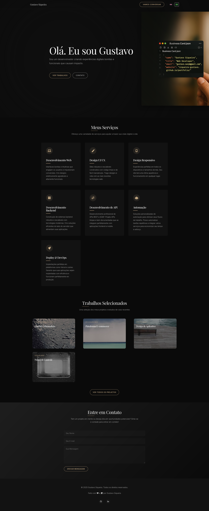

# Gustavo Siqueira - Personal Portfolio



A modern, responsive, and elegant personal portfolio website built with pure
HTML, CSS, and vanilla JavaScript. The website features a dark theme, smooth
animations, and full bilingual support (English and Portuguese).

## 🌟 Features

- **Responsive Design**: Looks great on all devices from mobile to desktop
- **Bilingual Support**: Switch between English and Portuguese (PT-BR)
- **Modern UI**: Clean, elegant design with smooth animations
- **Performance Optimized**: Fast loading with minimal dependencies
- **Accessible**: Built with web accessibility in mind
- **SEO Friendly**: Properly structured for search engines

## 🎨 Design System

The design follows a strict design system with:

- **Typography**:
  - Headings: Playfair Display
  - Body: Inter
- **Color Scheme**:
  - Primary: Elegant dark theme with beige/black palette
  - Accent colors for interactive elements
- **Layout**:
  - 12-column responsive grid
  - Consistent spacing system
  - Card-based design

## 🚀 Getting Started

### Prerequisites

- Modern web browser (Chrome, Firefox, Safari, Edge)
- (Optional) Local web server for development

### Installation

1. Clone the repository:

   ```bash
   git clone [your-repository-url]
   cd portfolio
   ```

2. Open `index.html` in your browser or use a local server:

   ```bash
   # Using Python's built-in server
   python -m http.server 8000
   ```

   Then visit `http://localhost:8000` in your browser.

## 🛠 Built With

- **HTML5** - Semantic markup
- **CSS3** - Custom properties, Flexbox, Grid
- **JavaScript (ES6+)** - Vanilla JS for interactions
- **Font Awesome** - Icons
- **Google Fonts** - Playfair Display & Inter

## 📱 Responsive Breakpoints

- **Desktop**: 1200px and up
- **Laptop**: 992px - 1199px
- **Tablet**: 768px - 991px
- **Mobile**: 576px - 767px
- **Small Mobile**: Up to 575px

## 🌐 Bilingual Support

The website supports two languages:

- English (default)
- Portuguese (PT-BR)

Language preference is saved in the browser's localStorage for returning
visitors.

## 🎯 Features by Section

### Navigation

- Fixed header with smooth scrolling
- Language switcher
- Mobile-responsive menu

### Hero Section

- Large, dramatic avatar
- Animated title
- Call-to-action button

### Services

- 3 service cards with hover effects
- Minimal icons
- Clean typography

### Portfolio

- 4 project cards with hover effects
- Image overlays
- Project links
- Responsive grid layout

### Contact

- Contact form
- Social media links
- Location information

## 📝 License

This project is licensed under the MIT License - see the [LICENSE](LICENSE) file
for details.

## 🙏 Acknowledgments

- [Font Awesome](https://fontawesome.com/) for icons
- [Google Fonts](https://fonts.google.com/) for typography
- [Unsplash](https://unsplash.com/) for placeholder images

## 📬 Contact

Gustavo Siqueira Email:
[gustavo.sarp@gmail.com](mailto:gustavo.sarp@gmail.com)  
Website: [gustavosiqueira.com](https://gustavosiqueira.com)

---

Made with ❤️ by Gustavo Siqueira
